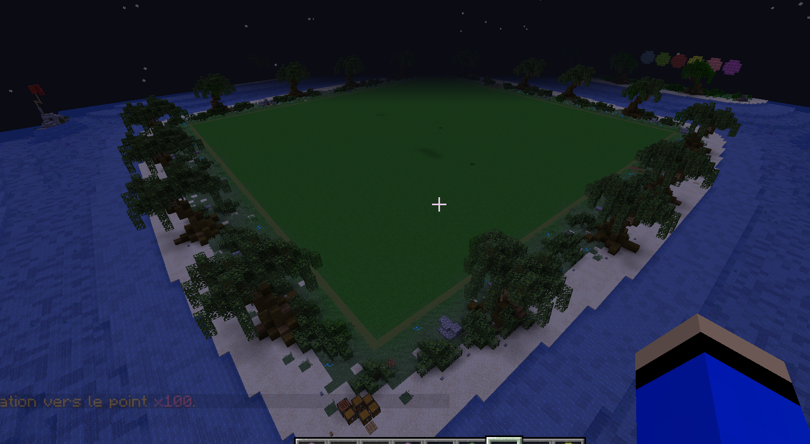

# Les bases

## Les différentes maps

3 maps de plots sont disponibles sur le serveur. Chacune d'entre elle propose des tailles de plots différentes, à savoir 50\*50, 100\*100 ou 300\*300.   
Vous pouvez accéder à chacune d'entre elles via l'onglet plot du /menu, ou via les commandes /warp x50, /warp x100 et /warp x300.

Attention, les plots 300x300 sont réservés au grade builder.
















**Lexique**  
On appelle aussi un plot une parcelle


La commande `/menu` vous permet de naviguer entre les différentes maps de plots et d'accéder à l'ensemble des fonctionnalités du serveur. Vous pouvez aussi faire un clic droit sur la montre pour ouvrir le menu. 


Si vous perdez votre montre, rejoignez le lobby `/lobby` puis revenez au créatif `/creatif`


## Les grades

Il existe deux grades, le grade par défaut et le grade builder. Le grade builder est obtenable par la [boutique](http://financement.over2craft.com) ou est gagnable lors d'évents spéciaux \(comme les concours de build\). Il peut aussi être décerné au mérite aux meilleurs builders qui ont déjà, à plusieurs reprises, contribué à Over2Craft.

Le grade builder donne notamment accès à un plus grand nombre de plots ainsi qu'un accès aux mondes personnels \(des mondes entiers privatisés\) et des outils avancés. L'ensemble des avantages du builder sont visibles IN-GAME depuis la commande `/menu` 

