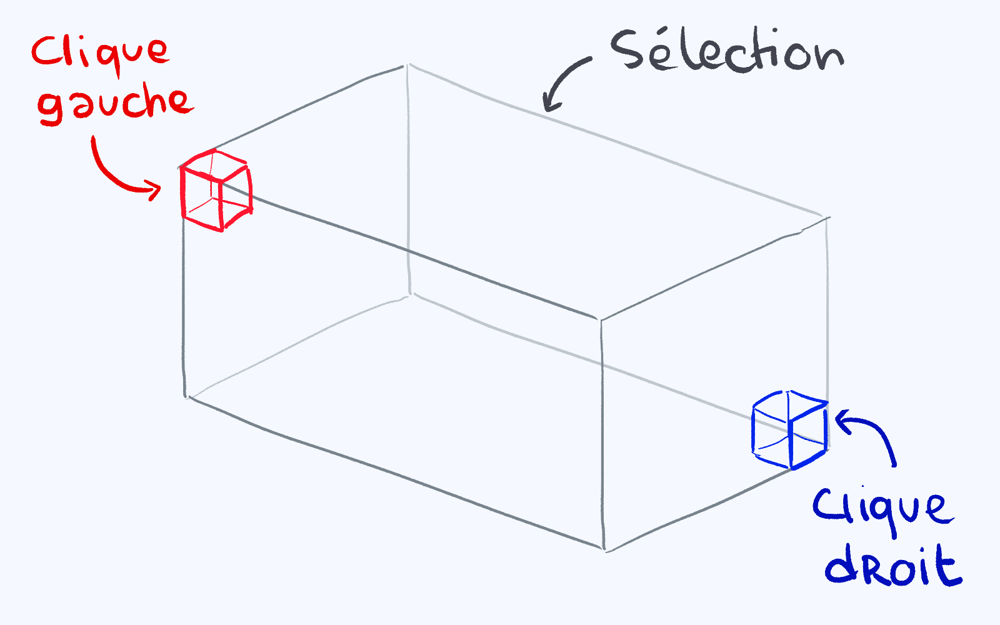

# Plugins

Le serveur créatif vous permet d'utiliser des plugins essentiels au build ou au terraforming, tel que :  

* World Edit \(FAWE\)
* VoxelSniper
* GoBrush
* GoPaint
* Générateur de bannière
* Custom Heads \(Builders uniquement\)
* Arceon \(Builders uniquement\)
* Armor stand editor \(Builders uniquement\)

Rappel : Toute tentative de crash est interdite, et sera punie d'un bannissement du serveur créatif.

## World Edit

Limitations : l'utilisations de certains blocs est bloquée avec world edit, ainsi que certaines commandes \(tel que le `//stack`\). Si l'une des limitations vous pose problème pour build, n'hésitez a venir nous en parler ou demander une alternative dans le channel "Aide Créatif" du serveur discord.

Tout d'abord, World Edit s'utilise avec une hache en bois, obtenable avec //wand.

Pour faire une sélection, il faut faire une fois clique droit sur un bloc, puis clique droit sur l'autre, ou utiliser les commandes `//pos1` et `//pos2` pour mettre la position là ou vous vous trouvez.

Vous pouvez annuler une action avec la commande `//undo` \(attention, s'applique aussi à GoBrush et GoPaint\)

**Sélection de zone :**

De base, votre sélection aura une forme cuboid \(de cube ou pavé droit\), et il vous faudra faire une fois clique droit, puis une fois clique gauche pour faire votre selection :

Une fois une zone sélectionnée, vous aurez beaucoup de commandes disponibles. Voici quelques exemples :

`//set [block]` remplace toute la sélection par le bloc choisi.

exemples : `//set air`, `//set stone`, `//set oak_planks`

`//copy` copie la sélection. Attention, la sélection sera faite en fonction de là ou vous vous trouvez. 

Vous pourrez ensuite coller la sélection avec `//paste`

Avec `//paste -a`, vous collerez tout les blocs qui ne sont pas de l'air

`//line [bloc] [radius]` : relie les deux blocs sélectionnés

`//walls [bloc]` créera les murs de votre sélection

`//faces [bloc]` remplira tout les côtés de votre sélection \(comme //walls, mais avec le toit et sol en plus\)

**Commande à partir de votre position :**

A partir de là ou vous vous trouvez, vous pouvez effectuer différentes commandes :

`//sphere [bloc] [radius]` : créer une sphère pleine

`//cyl [bloc] [radius] [hauteur]` : créer un cylindre plein

`//fill [bloc] [radius] (profondeur) (direction)` : remplir la zone dans laquelle vous vous trouvez

Pour faire une forme creuse, vous pouvez ajouter "h" devant la forme \(exemple : `//hsphere`, `//hcyl`, `//hpyramid`...\)

**Brushs :**

Vous pouvez créer des brush World Edit en prenant un outil \(autre que la hache en bois\) dans votre main, et en utilisant la commande `/br`

`//br s [bloc] (radius)` : Le brush fera apparaître une sphère

`//br gravity (radius)` : Fait tomber les blocs comme s'ils étaient soumis à la gravité

`//br height` : un outil simple pour faire des montagnes

`//br cliff` : un outil simple pour faire des... falaises

`//br smooth` : pour lisser une surface. L'équivalent Voxel \(`/b bb` et `/b e smooth`\) est plus utilisé

Vous pouvez ajouter un mask sur votre outils, en le tenant en main avec la commande `/mask [bloc]` : le brush ne s'appliquera que sur le bloc de votre choix.

Plusieurs variantes de masks existent : 

`/mask air`: masque basique, ne s'applique que sur l'air

`/mask >[bloc]` : n'affectera que les blocs au dessus du bloc choisi \(exemple : /mask &gt;grass\_block\)

`/mask <[bloc]` : n'affectera que les blocs en dessous du bloc choisi

Vous pouvez aussi utiliser la commande `/gmask` : elle est similaire à `/mask`, mais n'est pas lié a un brush et s'applique à **toutes** les actions worldedit \(paste, brush, ect...\)

## VoxelSniper

VoxelSniper est principalement utilisé pour terraformer, et s'utilise avec une flèche et une poudre de creeper : la flèche executera le brush normal, et la poudre l'inverse.

Pour changer de brush, il faut taper les commandes pour activer les brushs. Vous pouvez changer la taille de votre brush avec `/b [nombre]`, et annuler une action avec `/u`.

VoxelSniper ne propose pas les commandes en autofill ici, il faut donc connaître les brushs :

`/b bb` : La flèche lisse la surface, la poudre ajoute de la matière \(très utilisé pour terraformer\)

`/b e lift` : La flèche ajoute de la matière, la poudre en enlève

`/b e smooth` : lisse le sol \(différent de `/b bb`\)

`/b e melt` : La flèche fait fondre, la gunpowder ajoute de la matière

N'hésitez pas a consulter des tutoriels ou demander sur le channel aide créatif du discord pour toute question :\)

## GoBrush & GoPaint

