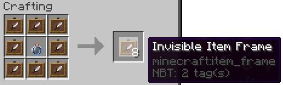

# Fonctionnalités

## Pets

Les pets sont des petits compagnons qui vous aident et vous accompagnent dans votre aventure. Ils vous donnent des bonus divers \(comme vous faire gagner de l'argent, vous faire voler, et bien d'autres...\). Consulter leurs bonus et acheter vos pets contre des Overs avec la commande `/pet`


Les pets perdent leur avantages quand ils sont échangés entre des joueurs `(/pet trade)`



Les **améliorations de pet** multiplient soit la force de l'effet \(par exemple force I devient force II\) soit la probabilité qu'une capacité arrive \(par exemple crypto aura plus de chance de donner des Overs toutes les 15 minutes, Merlin aura plus de chance de lancer des éclairs...\)


## Pêche

Découvrez les nombreuses fonctionnalités d'Over2Pêche avec la commande `/fish menu,` ou en pêchant votre premier poisson !  Vous pourrez pêcher plus de 100 poissons différents, dans des biomes ou des conditions uniques à chacun.

Attention, le serveur est équipé d'un anti-afk lorsque vous pêchez ! Pensez donc a changer régulièrement de coin de pêche, ou plus rien ne mordra à l'hameçon...

**Améliorations :**

Pour améliorer votre canne à pêche, il faut d'abord créer les améliorations. Elles nécessitent des ingrédients tels que les pinces/carapaces de crabe, et vous pouvez retrouver les recettes précises dans le `/fish augments`, ou ci-dessous. Assurez vous d'avoir le nombre exact de chaque ingrédients, jetez les dans un chaudron rempli d'eau, et tapez dessus avec votre canne à pêche !

L'amélioration vous sera donnée sous forme d'item, et vous pourrez l'utiliser sur une canne à pêche dans le `/fish augment` \(premier emplacement pour la canne à pêche, deuxième pour l'amélioration\).

**Attention** à bien utiliser le nombre exact d'items nécessaires, à ce que le chaudron soit rempli d'eau, et à ce que vous ayez l'entropie et le niveau nécessaire.

L'entropie est une sorte de monnaie interne au plugin de pêche : elle s'obtient en pêchant, vidant des poissons ou autre, et vous permet, entre autre, d'améliorer votre canne à pêche. Vous pouvez l'échanger entre joueurs en créant des Entropy Cristal dans le `/fish augment`.


**Taille de l'interface**  
Il est recommandé de régler sa taille de l'interface sur `2` dans `Echap > Options Graphique > Taille de l'interface`pour ne pas voir les menu tronqués





















































Toutes les 200 minutes un tournoi de pêche est lancé si il y a assez de joueurs connectés \(environ 18\).


## Ender Dragon


Les mobs \(boss également\) despawn si personne n'est à coté d'eux. Dans le cas du dragon, il deviendra un dragon commun et vous perdrez les loots. Si vous mourrez seul face au dragon, le dragon deviendra commun et ne lâchera plus rien. Si vous êtes deux et que vous mourrez tous les deux en même temps, même situation...


L'Ender Dragon réapparait dans l'ender à chaque reset le vendredi matin à 5h30. Si il a déjà été tué, [vous pouvez vous même le faire réapparaitre](https://fr-minecraft.net/astuce-minecraft-1362-faire-reapparaitre-l-ender-dragon.html) comme en vanilla avec des cristaux de l'End.

Il existe différents type de dragon, plus ou moins rare, qui donnent du stuff plus ou moins rare... 

**Dragon commun** \(50% de chance d'apparaitre\)

* [x] Celui qui à fait le plus de dégâts au dragon gagne une clé de vote
* [x] Un coffre comme celui-ci dessous est donné
* [x] Le coffre à 5% de chance de contenir un Œuf de Dragon

**Dragon rare** \(25% de chance d'apparaitre\)

* [x] Celui qui à fait le plus de dégâts au dragon gagne deux clés de vote
* [x] Un coffre comme celui-ci dessous est donné
* [x] Le coffre à 5% de chance de contenir un Œuf de Dragon
* [x] Celui qui à fait le plus de dégâts au dragon à 5% de chance de gagner une SuperMagical OverKey

**Dragon Epic** \(13% de chance d'apparaitre\)

* [x] Un coffre comme celui-ci dessous est donné
* [x] Le coffre à 80% de chance de contenir un Œuf de Dragon
* [x] Celui qui à fait le plus de dégâts au dragon à 80% de chance de gagner une SuperMagical OverKey

**Dragon légendaire** \(7% de chance d'apparaitre\)

* [x] Un coffre comme celui-ci dessous est donné
* [x] Le coffre à 100% de chance de contenir un Œuf de Dragon
* [x] Celui qui à fait le plus de dégâts au dragon à 100% de chance de gagner une SuperMagical OverKey


Plus le dragon est rare, plus le stuff qui est drop est fort. Mais le contenu du coffre reste aléatoire, les screens sont des exemples _\(véridiques, ils n'ont pas été amélioré pour le screen\)_.


## Chevaux

Lorsque vous sellez un cheval et que vous descendez de ce dernier après l'avoir monté, celui-ci disparait et vous donne une selle. Cette selle vous permet de faire réapparaitre votre cheval où vous le souhaitez. 


Si vous souhaitez ne pas faire disparaitre votre cheval en descendant, il vous faudra d'abord enlever la selle.


Certains joueurs peuvent faire de l'élevage de chevaux. Vous pourrez peut-être en trouver au `/shop` des joueurs ? :\)

## Échecs

Ici on adore les échecs... vous pouvez faire une partie au `/warp echecs`

## Têtes décoratives et têtes de joueurs 

Vous pouvez acheter des **têtes décoratives pour 500 Overs** avec la commande `/heads`.  
Vous pouvez acheter des **têtes de joueurs pour 2000 Overs** avec la commande `/playerhead <pseudo>`.  
Les premiums disposent de la commande /skull pour obtenir gratuitement une tête de joueur toutes les 12 heures. 

## Acheter un warp

Vous pouvez acheter un warp avec la commande `/buywarp` pour 20 000 Overs. Ce warp sera valable pour 30 jours. Si vous souhaitez placer un warp pour un shop, faites plutôt [référencer votre shop](freebuild-economie.md#shop-joueurs)...

## Spawner

Vous pouvez trouver et récolter les spawners que vous trouvez dans la nature avec une pioche Toucher de Soie \(Silk Touch\). 

En posant votre spawner, vous pouvez faire un clic droit pour accéder au menu de gestion de votre spawner et payer en Over pour **changer le type de mobs et l'améliorer**.

## Collecteur automatique \(Autoshulker\)

Vous pouvez créer des ShulkerBox spéciale \(AutoShulker\) qui récolteront automatiquement les blocs minés. Pour crafter une AutoShulker, poser simplement une Shulker, un livre, et le ou les items que vous souhaitez collecter automatiquement. 

L'auto Shulker contiendra automatiquement un livre à l'intérieur. Ce livre récapitule ce  que la ShulkerBox est capable de collecter. Vous devez laisser ce livre pour faire fonctionner votre AutoShulker. 

Il existe aussi une GarbageBox \(Shulker poubelle\) qui, au lieu de récupérer vos items, les détruit directement. Il suffit à la place du livre de mettre un seau de lave. Mais cette fonctionnalité s'achète dans le `/competences` à l'inverse de l'autre.

## Mariage

Pour vous marier \(avec qui vous voulez...\) contactez un animateur pour qu'on organise votre cérémonie ;\). Il vous faudra 5000 Overs. La polygamie est interdite... Désolé ! 

## Un plan mystérieux \(invocation de boss le Magicien suprême\)


Les mobs \(dragon et boss également\) despawn si personne n'est à coté d'eux. Si vous mourrez seul face à lui, il despawnera.


On ne sait pas trop ce que c'est ni d'où ça vient... on a juste un plan étrange... qui semble très dangereux. 

* [x] **100%** de chances de drop les items suivant 

  
Rendez-vous dans[ la rubrique enchantements](enchantements.md) pour voir ce que font les enchantementsexit: Ctrl+↩

Pour **invoquer** ce boss il faut déchiffrer le plan ci-dessous. Il s'invoque en assemblant une pile de matériaux à la manière des Wither, Golem...\)

## Un autre plan mystérieux \(invocation de boss le Golem du Magicien Suprême\)

On ne sait pas trop ce que c'est ni d'où ça vient... on a juste un plan étrange... qui semble très dangereux. 

* [x] **100%** de chances de drop un livre **Protection 5**
* [x] **80%** de chances de drop **l'Arc de Zeus** \(démo ici [https://streamable.com/a71d00](https://streamable.com/a71d00)\)

Rendez-vous dans [la rubrique enchantements](enchantements.md) pour voir ce que font les enchantements


Pour **invoquer** ce boss il faut déchiffrer le plan ci-dessous. Il s'invoque en assemblant une pile de matériaux à la manière des Wither, Golem...\)


## Un autre plan mystérieux \(invocation du Loup alpha\)

On ne sait pas trop ce que c'est ni d'où ça vient... on a juste un plan étrange... qui semble très dangereux. 

* [x] **100%** de chances de drop l'esprit du loup qui vous permettra de l'invoquer par le `/monture`


Pour **invoquer** ce boss il faut déchiffrer le plan ci-dessous. Il s'invoque en assemblant une pile de matériaux à la manière des Wither, Golem...\)


## Coffre à la mort

En mourant, un ange récupère votre stuff et le pose dans un coffre proche de votre lieu de mort. Votre stuff reste au sol si vous mourrez dans un endroit où vous ne pouvez pas construire. Fais `/back`pour retourner sur le lieu de ta mort. 

## Tomber dans le vide

Tomber dans le vide dans l'end vous ramène au spawn et vous ne mourrez pas... mais votre /back ne fonctionnera pas.

## **Alertes de durabilité**

Vous pouvez activer des alertes de durabilité. Elles sont désactivées par défaut

* `/da toggle` pour activer ou désactiver les alertes \(elles sont désactivées par défaut\) 

Vous pouvez laisser les paramètres d'alertes par défaut après l'avoir activé ou régler vos paramètres plus précisément :

* `/da enchant` activer les alerts que pour les items enchantés 
* `/da armor`  Définir à partir de quand l'alerte se lance pour les armures 
* `/da tools`  Définir à partir de quand l'alerte se lance pour les outils

## Trident 

* Les tridents ne disparaissent plus quand vous les jetez dans le vide
* Les tridents fonctionnent comme sur Bedrock Edition \(ils font des dégâts supplémentaire aux mobs qui touchent de l'eau\)
* Le trident est lancé depuis la main secondaire, il retournera dans la main secondaire
* Les noyés ont désormais plus de chance de dropper un trident \(comme sur Bedrock edition\)

## Organisation automatique des coffres

Utilisez la commande `/orga` in-game pour paramétrer l'organisation automatique de vos coffres.

 Quand on exécute cette commande, on arrive sur cette interface. Les deux blocs de la ligne du bas permettent d'activer le remplissage \(bloc de gauche\) et le vidage \(bloc de droite\) du coffre à l'aide d'un double clic droit \(pour le remplissage\) et double clic gauche \(pour le vidage\). Il faut double cliquer à **l'extérieur de l'interface** du coffre pour que cela fonctionne \(voir image ci-dessous\).

## Item frame invisible 

 Une compétences est achetable pour 200k Overs dans le `/competences` \(ou sur la boutique pour nous soutenir  [http://financement.over2craft.com/](http://financement.over2craft.com/)\). Elle vous permet de crafter et utiliser des items frames invisibles.

