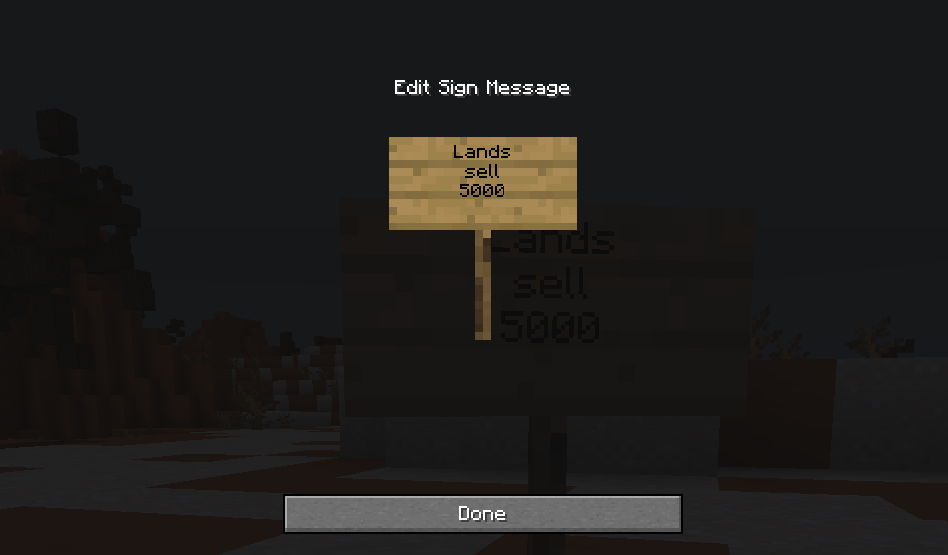
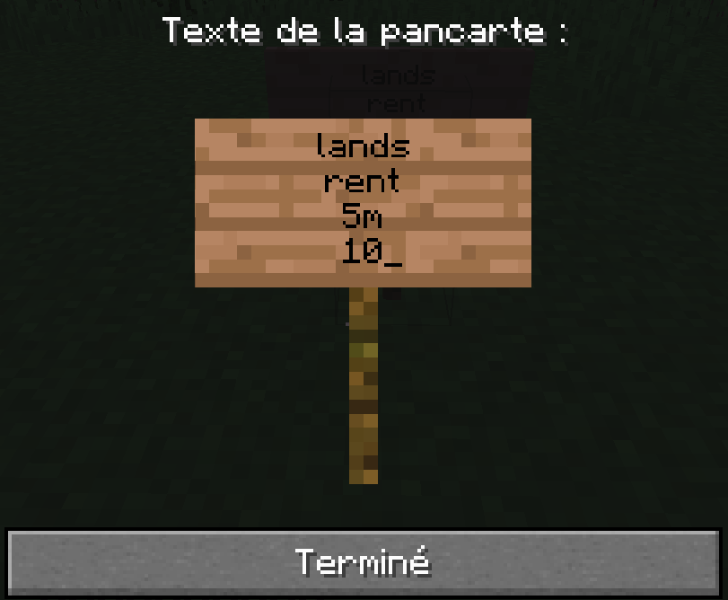

# Terrain et claim

## Fonctionnement des claims

Un claim est une zone protégée qui appartient à un "territoire". Un territoire appartient lui même à un joueur. Vous pouvez comparer un "territoire" à une ville ou même une faction sur certains serveurs. 

L'édition des territoires est très poussé, un joueur peut lui même créer sa propre ville et mettre des parcelles en vente.

Vous pouvez manipuler les territoires et claim avec les commande `/territoire <commande>` ou le menu `/territoire menu`. La commande /territoire menu vous permet d'éditer le territoire sélectionné 


Vous éditez soit celui par défaut si vous en avez qu'un seul, sinon la commande `/territoire edit <nom du territoire>` vous permet de forcer la sélection d'un territoire. 


`/territoire menu main` vous permet d'afficher le menu de tout les territoires. 

## Villes \(territoire publiques\)

Liste des territoires publique `/territoire list`

## Créer son territoire

Vous pouvez créer votre territoire avec la commande `/territoire create <nom de votre territoire>`

* Un territoire peut posséder jusqu'à 50 membres
* Vous pouvez claim gratuitement 5 chunks par territoire. 
* Si vous avez besoin de claim plus de 5 chunks, le claim vous coutera 1500 Overs. 
* Vous pouvez avoir au maximum 50 claims. 
* Vous pouvez être membre au maximum de 8 territoire et propriétaire de 1. 

## Claim une zone

Pour claim une zone vous pouvez utiliser la commande `/territoire claim`


Vous pouvez **visualiser** les **claims** avec la commande `/territoire map` et `/territoire view`



Pour **unclaim** une zone il suffira de faire `/territoire unclaim`. Vous récupérer 15% de la valeur du claim.


## Point de spawn

Vous pouvez définir le point de spawn de votre territoire avec la commande `/territoire setspawn`

## Inviter un ami

Vous pouvez inviter un ami avec la commande `/territoire trust <pseudo>`

Il devra ensuite accepter la demande avec la commande `/territoire invites`. Un menu apparaitra lui permettant d'accepter l'invitation apparaitra. 

## Monnayer son territoire

 ****Avant de mettre en vente ou à la location une parcelle ou une maison vous devez créer une région.

### **Pour proposer une parcelle ou une maison à la vente**

Mettez un panneau dans la région que vous avez choisie


 Première ligne : « Lands »  
 Deuxième ligne : « sell »  
 Troisième ligne : le montant


### **Pour proposer une parcelle ou une maison à la location**


Première ligne : « Lands »  
Deuxième ligne : « rent »  
Troisième ligne : « Temps de la location » en Minutes \(m\), heures \(h\), Jours \(d\)  
Quatrième ligne : « Prix » 


